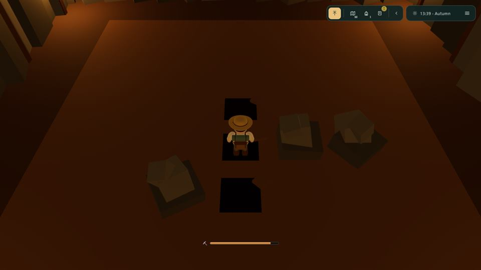

# Speeltest van de quests (8 oktober 2026)

**🚧 Status: speelrapport; vier bugs gerepareerd en de twee besluiten van de keeper over de mijn gebouwd
op `claude/determined-mestorf-c43d75`, de rest staat hieronder als bevinding of vraag.** Gespeeld: de schattenjacht met de roeiboot van begin tot eind, en de
goudmijn-lijn tot en met verdieping 5 (gestopt op verzoek van de keeper; de sleutel is nog niet gehaald).

De keeper vroeg letterlijk: *"Laat een agent de quest spelen."* Tijdens het spelen kwam erbij:
*"neem mee in het onderzoek dat de graafplekken niet zichtbaar moeten zijn. en dat de ruimte net zo groot
is als de graafbare cellen. neem 10x10 veld. laat de camera ook meer van boven kijken"* - en daarna:
*"maak er toch maar 7x7 van. en de ruimte is prima zo"*. Zie [Besluiten van de keeper](#besluiten-van-de-keeper).

## Hoe er gespeeld is

- **Op een kopie van het eiland** (BierRum, 143 inwoners, met mijn, goudsmid, taverne, piratenkist en
  Salty Kraken): `~/.promptholm` gekopieerd zonder `*.lock`, `*.log`, `audio/` en `data/sea-token.json`, de
  zee op `single` (eigen poort), `network.public` uit; `serve.mjs --no-rescan --no-open` uit de worktree met
  `PROMPTHOLM_HOME` op de kopie. Het live eiland en de open zee zijn niet aangeraakt.
- **In een echte Chrome met echte frames** (headless, 37 fps, bestuurd over CDP): toetsen (W A S D, E,
  Shift, Escape) en muis (slepen om te kijken, klikken op knoppen) zoals een speler. Een klein script stuurde
  de camera met de muis en hield W ingedrukt; in de boot W met A/D aan het roer; in de mijn ging het lijf
  vóór een plek staan en drukte E. Van de mijn las het script alleen de rotsen af (die zie je toch) - nooit
  waar de trap of de stenen liggen.
- **Geteleporteerd** alleen om lang lopen over te slaan, en altijd het laatste stuk zelf gelopen: van het
  plein naar de piratenkist, naar de oosthaven, naar de goudsmid, de mijn en de taverne, en één keer terug
  naar het eilandje na een herlaadtest (de roeitocht erheen was er al twee keer met de hand). Geen
  `?quest=`, geen staat direct gezet.
- Console en serverlog zijn de hele sessie meegelezen: **geen fouten** in beide.

## 1. Schattenjacht en roeiboot

| Stap | Wat er gebeurde | Oordeel |
|---|---|---|
| Piraat bij zijn kist | "E speak to the pirate", venster *The First Dig*, Accept → schep en kaart (eilandje M9, ~590 eenheden oost). | ✅ |
| Naar het eilandje | Roeiboot aan de oosthaven ("E take the boat"), 500 eenheden in ~1 minuut. Bij aankomst ligt er al een tweede roeiboot klaar ("A little rowing boat lies ready off the islet"). | ✅ |
| Graven | "E dig here" op de X, de schep, "The shovel rings on gold!", quest *Bring It Home*. | ✅ |
| Tillen | "E lift the statue", gedragen. | ✅ |
| Beeld in de boot | Ertegenaan lopen legt het erin ("You lay the statue in the rowing boat"), stap gaat door. | ✅ |
| Instappen en roeien | E boardt, W/S roeien, A/D roer; het beeld ligt zichtbaar in de boot. | ✅ |
| Hijsen bij het galjoen | "E hoist the statue aboard" aan de ladder, beeld op het dek, roeiboot blijft liggen. | ✅ maar zie B1 |
| Laten zakken | Op het dek "E lower the statue into the rowing boat", je zit weer aan de riemen, aan de landkant. | ✅ |
| Aan land stappen | "E step ashore" → het beeld weer in de armen. | ✅ |
| Op het plein zetten | "E set the statue down in the square", beeld staat, `treasure.json` → `placed`. | ✅ maar zie bug 3 |
| De piraat vertellen | Hij liep om 12:30 naar de lunch (de bel van de zee); ingehaald, *Hand it over*, Sea green. | ✅ zie B4 |

**Randgevallen.**
- *Herladen met het beeld in de armen*: `pagehide` stuurt `dropped`, het beeld ligt weer op het eilandje,
  de quest blijft op zijn stap. ✅ Maar je komt terug **op het plein** (zie B2).
- *Herladen met het beeld in de boot*: idem, terug op het zand van het eilandje. ✅
- *Het beeld laten liggen*: het blijft op het eilandje, ook na herladen. ✅
- *De roeiboot wegroeien*: niet apart gedaan; bij elke terugkeer naar het eilandje werd een nieuwe skiff
  klaargelegd (ook na een herlaad, waarbij de oude zonk). ✅

## 2. Goudmijn-zoektocht

| Stap | Wat er gebeurde | Oordeel |
|---|---|---|
| Goudsmid | "E talk to the goldsmith", *Into the Mine*, Accept. | ✅ (bug 1) |
| De mijn in | "E step into the gold mine", toast met uitleg, graafbalk (⛏️) zichtbaar. | ✅ |
| Graven | 1/30 van de balk per beurt; quartz, amethyst, niets; trap. | ✅ zie B6 |
| Stenen weigeren | Op een rots "E a rock - nothing digs that", toast "A rock. Nothing digs through that." | ✅ |
| Verkopen | E bij de goudsmid verkoopt alle stenen (2 → 11 munten, later 3 → 14). | ✅ |
| Drankje kopen | Toog in de dorpstaverne, 12 munten; derde keer met 4 in de beurs geweigerd. | ✅ na bug 4 |
| Drankje drinken | Met een lege balk: "E too tired to dig - drink a draught" → balk vol. Zonder drankje: "too tired to dig, and no draught left" + uitleg. | ✅ |
| Trap af | "E go down the stair", "Floor 2 of 7." Bij verdieping 3: *Deeper Still* door naar de goudsmid. | ✅ |
| Eruit en opnieuw | Zelfde rotsen en trappen die dag; met de onthouden trappen ben je in twee graafbeurten op verdieping 3. | ✅ |
| Ladder naar buiten | Deed niets op E (bug 2). Nu: "E climb the ladder out of the mine". | ✅ na bug 2 |
| Pagina dicht in de mijn | Terug op het plein, balk bewaard (vult buiten bij). | ✅ |
| Verdieping 5-7, de sleutel | Niet gehaald: gestopt op verzoek. | - |

**Getallen, gemeten** (eiland 1337, wereld-dag 20734):

| Verdieping | graafbeurten tot de trap | stenen gevonden |
|---|---|---|
| 1 | 33 (van 46 aarde) | 5 |
| 2 | 30 (van 40) | 0 |
| 3 | 18 (van 45) | 0 |
| 4 | 23 (van 42) | 2 |

Ruim 100 graafbeurten voor vier verdiepingen, dus ruim drie volle balken; een balk vult buiten in 10
minuten, een drankje kost 12. Uit ~100 beurten kwamen 7 stenen (36 munten): **de mijn betaalt zijn eigen
drankjes niet**, zeker niet bovenin (gemiddeld 12,5% van de plekken heeft een steen, maar deze dag had
verdieping 2 er 0 van 40 en 3 er 1 van 45). Met 15 munten om te beginnen en geen zaadkraam gespeeld, moest
er tussen de bezoeken 10 minuten gewacht worden. Of dat de bedoeling is, is aan de keeper (zie vragen).

## Bugs, gerepareerd (met test)

1. **De goudsmid praatte als de piraat**: "Well, matey?", de knop *Hand it over* en afsluiten met *Aye*
   ([screenshot](speeltest-quests/goudsmid-als-piraat.jpg)). `giverSpeech` gebruikte de woorden van de
   piraat voor elke gever. Nu een stem per gever (`voiceOf` in `web/js/pirate.js`): de goudsmid vraagt
   "Back again? Let us hear it.", de knop heet *Tell him*, afsluiten *Goodbye*
   ([screenshot](speeltest-quests/goudsmid-eigen-stem.jpg)). Piraat en crew ongewijzigd.
2. **De ladder in de mijn was decor.** Beide teksten (bij binnenkomst en als je op bent) sturen je naar
   "the ladder by the way in", maar E deed daar niets; alleen door de deuropening kwam je eruit. Nu een
   `exits`-ingang op de ladder (interior.js' bestaande mechanisme, zonder `to`: naar buiten zoals door de deur).
3. **"The treasure statue arrived and pitched a tent."** Elk nieuw record kreeg bij binnenkomst die toast,
   ook een civic ([screenshot](speeltest-quests/beeld-op-plein-tent-melding.jpg)). Nu alleen wie er komt
   wonen; het beeld en een mijlpaal hebben hun eigen melding.
4. **De toog was bijna onbereikbaar.** Een staande stamgast stond 0,23 van de plek waar het drankje verkocht
   wordt; je kwam er alleen bij door een kier van een paar centimeter tussen hem en zijn maat. Hij staat nu in
   de hoek voorbij het westeinde van de bar. Getest met de echte walk mode, van de deur naar de toog.

Tests: `tests/speeltest-quests.test.mjs` (stem, ladder, tent) en `tests/tavern-counter.test.mjs` (de toog,
gelopen). Alles patch: geen layout, bundle of `SEA_V`.

## Bevindingen die een keuze vragen

- **B1. Een roeiboot vaart dwars door het galjoen.** Boten botsen alleen met de grond en de vaste Batavia
  (`shipSolids`), niet met een schip dat zelf een boot is. Met wat vaart schoot de roeiboot onder de ladder
  door tot ín de romp ([screenshot](speeltest-quests/roeiboot-in-galjoen.jpg)), en de hijs-prompt kwam daar
  ook. Een mens zal meestal netjes afremmen, maar het ziet er kapot uit. Oplossen = rompen van schepen als
  obstakel voor boten (`hullOver`/`stepBoat`), groter dan een fix.
  ✅ *Opgelost (8 okt 2026)*: elk galjoen is aan de waterlijn een muur voor elke andere romp die walk.js
  stuurt - haar eigen vorm uit de bake (`SHIPWALK.side`, boat.js `shipsOver`), op haar plek en koers van nu,
  dus de voet van de ladder blijft binnen `HOIST_REACH` (`tests/boat-ships.test.mjs`). Nog open: een
  varend galjoen duwt een stilliggende roeiboot niet opzij (zij vaart er nog doorheen).
- **B2. Herladen zet je altijd op het plein.** `parkOnSquare` bij het opstarten gaat vóór de bewaarde plek
  (`recalledSpot` komt pas als het lijf niet geparkeerd is), dus wie herlaadt op het eilandje van de schat
  moet 500 eenheden terugroeien om het beeld (dat netjes terug op het zand ligt) weer op te halen.
- **B3. Op een opgegraven trap staan en E drukken = naar beneden**, ook als je de plek vóór je wilde graven
  (`target()` in mine-room.js kiest de trap onder je voeten eerst). De prompt zegt het wel ("go down the
  stair"), maar het voelt als een valkuil; het script trapte er zelf in.
- **B4. De piraat loopt weg bij de lunchbel** (12:30 op de zeeklok) en dan moet je een lopende NPC
  achterna om "Tell the pirate it is done" af te ronden; zijn E-bereik beweegt mee en mist makkelijk.
- **B5. De toog is onzichtbaar.** Het drankje koop je op een plek naast het vat aan het westeinde van de bar
  ([screenshot](speeltest-quests/toog-plek-bij-het-vat.jpg)), terwijl de barman midden achter de bar staat
  en de waard buiten alleen "Quiet in here" zegt. Voorstel: de barman verkoopt het (E bij hem), of een
  bordje/flesjes op dat stuk toog.
- **B6. In de mijn zie je weinig.** Het is donker, de camera hangt laag achter je, en het lijf staat precies
  vóór de plek die je graaft, dus de kuil zie je niet ontstaan ([screenshot](speeltest-quests/mijn-eerste-kuil.jpg));
  de opgegraven trap is een donker gat ([screenshot](speeltest-quests/mijn-trap.jpg)). Dit sluit aan op het
  besluit van de keeper hieronder (camera meer van boven).
- **Kleinere tekstpunten**: na een afgeronde quest van de goudsmid zie je alleen "On offer: …" en moet je
  het venster sluiten en weer E drukken voor de volgende pitch; *On offer: Old iron key* verklapt wat er
  onderin ligt terwijl hij zegt "whatever lies on the last floor"; *Hand it over* bij de piraat terwijl er
  niets te overhandigen is; "Their pub stands by the harbour once the lighthouse burns" terwijl de Kraken
  naast zijn kist staat; serverfouten als "a draught is 12 coins and the purse holds 4" komen rauw (kleine
  letter) in de toast.

## Besluiten van de keeper

Tijdens de test (8 oktober 2026):

| Vraag | Besluit |
|---|---|
| Zijn de graafplekken te zien? | **Nee**: geen hoopjes per cel meer, de vloer van het veld ziet er overal hetzelfde uit; je ziet pas wat er was als je gegraven hebt. |
| Veld | **7 x 7 blijft** (eerst 10 x 10 gevraagd, daarna teruggedraaid). |
| De ruimte | **Blijft zoals hij is** (eerst "net zo groot als de graafbare cellen", daarna teruggedraaid). |
| Camera | **Meer van boven kijken** in de mijn. |

Gebouwd (de keeper: *"bouw de onzichtbare graafplekken en de camera van boven"*):

- *Onzichtbare plekken*: `fieldParts` in `web/js/mine-room.js` tekent een onaangeroerde plek niet meer;
  rotsen, kuilen, de trap en de sleutel blijven. Alleen de hoopjes weglaten maakte het veld een zwarte vlek
  (de grotvloer is donker en de hoopjes vingen het licht), dus het hele veld ligt nu onder één effen bed losse
  aarde dat niets verraadt van waar de plekken liggen, en de lampen en het omgevingslicht zijn wat feller
  (`LAMP` 3,2, was 2,4). Geen cursor op de vloer: de prompt ("E dig here") is de enige hint.
- *Camera van boven*: een kamer mag nu zijn eigen kijkhoek bij binnenkomst opgeven (`camera.pitch`,
  interior.js; zonder blijft het 0,05). De mijn kijkt met `MINE_PITCH` 0,75 en `back` 3,0 neer op het veld,
  door het rotsplafond heen dat interior.js als deksel weghaalt; met de muis kun je nog vlakker kijken. Je
  ziet de kuil ontstaan en het grootste deel van het veld tegelijk.

## Vragen voor de coördinator

1. B1 (boten door schepen) en B2 (herladen zet je op het plein): eigen chip, of laten zo?
2. Balans: de mijn betaalt de drankjes niet (≈ 0,35 munt per graafbeurt tegen 0,4 per beurt aan
   drankje). Bewust, of de prijzen/kansen in `shared/mine.mjs` bijstellen?
