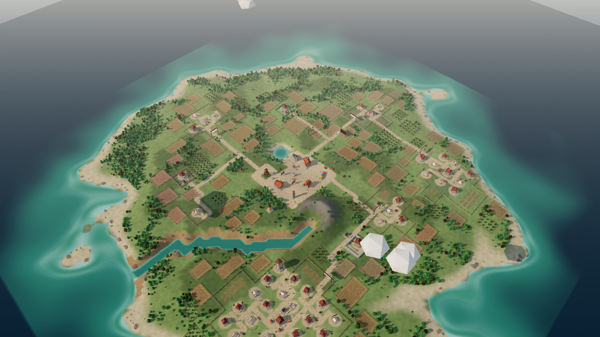
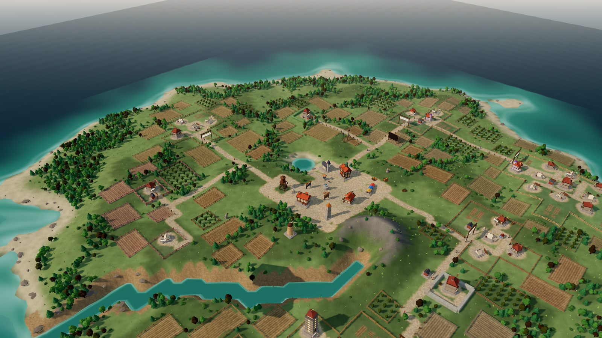
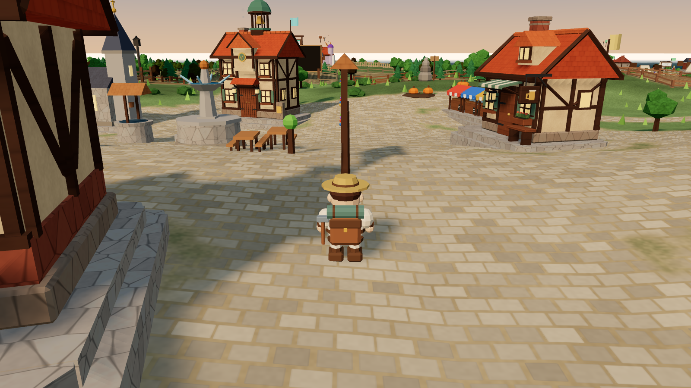
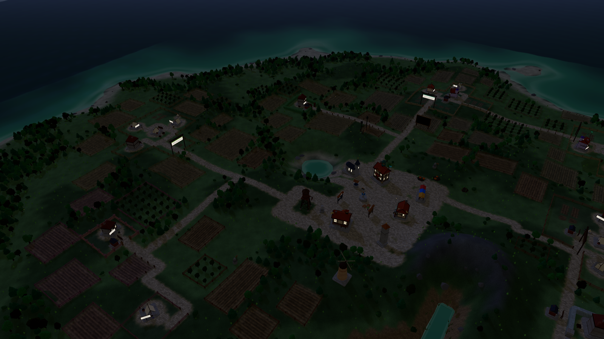

# Promptholm

A 3D island where the Claude agents you work with live. Every Claude Code or Cowork
session is a settler who arrives, pitches a tent, and builds a house that grows as the
session does. Subagents become apprentices with their own sheds in the yard.

Nothing is invented: every building is read from the session records already on this
machine. No network calls, no API keys, no data leaves the computer.



## Getting started

Windows, Node 20 or newer, Claude Code installed:

```bash
git clone https://github.com/TiemenAfman/AgentVillage.git
cd AgentVillage
npm install
npm run setup
npm run dev
```

`npm run setup` founds your island as of now, so it starts empty and grows, and adds the
session hook to `~/.claude/settings.json` after backing that file up. It leaves every
other setting, including your own hooks, alone. `npm run setup:remove` takes it back out.

Your island is your own: `seed` in `config.json` decides the shape of the land and
`islandName` names it. `config.json` is not in the repository, so nobody inherits anyone
else's village.

[docs/getting-started.md](docs/getting-started.md) has the longer version, including how
to work on the code.

## Running it

Best as its own window rather than a browser tab: double-click `start-island-app.cmd`, or
open http://localhost:4747 once and use Chrome's **Install page as app**. The island then
gets a taskbar icon and a window with no tab strip or address bar, which is what you want
for something you keep open beside your work.

```bash
npm run dev
```

That starts the island at http://localhost:4747 and opens a browser. Double-clicking
`start-island.cmd` does the same, and `stop-island.cmd` shuts it down again. Leave it
running and the page updates itself as sessions come and go.

| Command | What it does |
|---|---|
| `npm run dev` | Serve the island and open it |
| `npm run serve` | Serve without opening a browser |
| `npm run scan` | Rebuild `data/village.json` once |
| `npm run scan:all` | Rebuild ignoring the founding date, using every session ever recorded |
| `npm run vendor` | Re-copy three.js into `web/vendor` after `npm install` |

Drag to rotate, right-drag or shift-drag to pan, scroll to zoom. Click a building for
its dossier. The chronicle bar at the bottom replays the growth of the village.

Useful URL parameters: `?nointro` skips the opening camera move, `?hour=21` freezes the
time of day (handy for looking at the island at night).

## Every morning at 07:30

A Windows scheduled task called **Promptholm island** starts the server each morning, so
the village is already up and scanning when you sit down. It runs
`start-island-hidden.vbs`, which launches the server with no console window. If the
island is already running it notices the port is taken and exits quietly, so it can
never start a second copy.

| | |
|---|---|
| Stop the island | `stop-island.cmd` |
| Change the time or the days | Task Scheduler, or `Set-ScheduledTrigger` on `Promptholm island` |
| Turn the schedule off | `Unregister-ScheduledTask -TaskName "Promptholm island"` |

The server listens on 127.0.0.1 only and refuses requests whose Origin is not the island
 itself, because it can start unattended agents in any folder on this machine.

The task runs as you and only when you are logged on, and it catches up if the machine
was off at 07:30. It does not open a browser; go to http://localhost:4747 when you want
to look. Add `--open` to the `sh.Run` line in the .vbs if you would rather it opened
itself.

## Walking the island

Press **Walk** (or **A** on a controller) and you step onto the town square as a settler
with a straw hat. WASD or the left stick to walk, drag the mouse or use the right stick
to look, Shift or the right shoulder button to run. Walk up to a house and press **E**
(**A** on the pad) to read its dossier; **Esc** or **B** flies you back up to the sky.

**Space** jumps, which is enough to clear a doorstep or a low hedge. **Ctrl** crouches;
keep it held while standing still and the settler decides the day is over, lies down and
puts up a parasol. Moving puts that clock back to zero, so a crouch-walk does not end in
a nap. Lying down outlasts the key - let go of Ctrl and they stay there. Walk, or press
Ctrl again, to get back up. You can wade into
the sea as long as the shore stays within reach - about two metres - and you swim rather
than walk once you are past the waterline. You cannot jump out of the water, and you
cannot set out for the horizon.

Any XInput controller works: plug it in, press a button so the browser notices it, and
the on-screen hints switch to controller buttons. Left stick walks, right stick looks,
right shoulder runs, **A** uses what you are standing at, **B** flies back up. Nothing needs a
controller: mouse and keyboard do everything on their own.

## Talking to a settler

Walk up to a house and press **E** (**A** on the controller), or open its dossier and use
**Talk to them**. Their session transcript opens as a conversation: what you asked, what
they answered, and the tools they reached for along the way. A long stretch of tool work
is folded into one turn with the last few calls shown, so it reads the way the session
actually went rather than as hundreds of fragments.

Type in the box and the conversation carries on **in that same session**. Resuming keeps
the session id, so what you say lands in the very transcript the island reads: talk to a
settler and their house grows from it. The reply streams in as it is produced, tool calls
and all, and **Stop** cuts it short.

The dropdown in the corner says what the settler may do while you talk:

| | |
|---|---|
| Can do anything | Reads, writes and runs things, unattended |
| May edit files | Changes files, shell work still needs a person |
| Read only | Looks and plans, changes nothing |

Apprentices are different. They reported back to their master and their session is over,
so their shed opens as a record of what they did, with no box to type in.

## Starting a new session from the island

**New settler** in the top right, or walk up to the town hall and press **E**. Pick the folder
they should live in, pick a model, and optionally say what they should start on. A fresh
Claude session begins there, a house appears, and you carry on with them by walking up and
pressing **E** again, which opens their conversation.

They are a resident, not a visitor: no ticket is attached and they stay until you send
them away. Sessions you start the ordinary way, in the desktop app, in VS Code or from a
terminal, arrive on the island by themselves through the session hook.

## The office

Every district that is a git repository has an office on its square. Walk in, or click
it, and you get what git has to say about that repo: the branch and how far it has
drifted from its upstream, what is waiting in the working tree, and the recent history.
Click a file for its diff, click a commit for its message, its stat and its patch.

It only reads. The one thing it will change is remote-tracking refs, through a **Fetch**
button, which never touches your work. Staging, rebasing and untangling a merge belong
in a real client, so the office lists the ones you have installed and opens them at that
repository: Git Extensions, Fork, SourceTree, GitHub Desktop, VS Code, or plain File
Explorer. Whatever is not installed is simply not offered.

The page names a district, never a path, so no request can point git at some other
folder on the machine.

## Telling an agent how your team works

The island does not know your workflow, so it does not carry one. What a dispatched
agent is told comes from `config.json`:

```json
"dispatch": {
  "opening": "Pick up {key}",
  "skill": null,
  "language": "en"
}
```

The `opening` is the first line of the prompt, so make it the phrase your own project
skill triggers on. Name that skill in `skill` and the agent is told to follow it from
beginning to end; leave it `null` and the agent is simply asked to work the ticket the
way the project does. `{key}`, `{summary}`, `{settler}` and `{island}` are filled in.

The skill itself belongs in the repository the agent works in, next to the code it
describes, not here. That is also where it stays private.

## Inviting a session that already exists

Walk up to the town hall and press **E**, or use **New settler** in the top right. The
register lists every session this machine remembers, with the name the island would give
it, what it worked on and how big its house would be. **Invite** gives it a plot, and it
builds according to what it actually did.

This is how sessions from before the island was founded get in. **Release** takes one back
out of the register; that is not the same as sending a settler away, and an invited
settler can always be invited again. Sessions that arrived on their own, through the
hook, need no invitation and cannot be released this way.

The same panel has **Send for a newcomer instead**, which starts a brand new session.

## Who gets a house, and who is only visiting

Not every session that starts becomes a settler. Plenty of them begin and end within
seconds without ever writing a line; those are not people, they are process noise, and
the island ignores them. A session earns a house by saying something.

Agents the island sends out itself, from the sprint board, are **visitors**. They pitch a
tent, do the one job they were sent for, and are gone half an hour after they fall quiet.
Their dossier says *Visiting*, and the record of what they did stays on the board under
"Handed out". Everyone else is a resident and keeps their house until you send them away.
The grace period is `visitorGraceMs` in `config.json`.

## Sending a settler away

Walk up to a house and press **X** (**X** on the controller), use **Send away** in the top right
of a settler's conversation, or open their dossier and use **Send off the island**. It always asks twice: the first press shows who you are about to
send away, the second confirms. The house comes apart in a cloud of dust, the settler's
apprentices leave with them, and their plot becomes ordinary ground that a later arrival
can build on.

This removes them from the island and nothing else. **The session transcript is never
touched**, so nothing about your Claude history is lost, and the toast that appears offers
**Bring them back** for as long as it is on screen. After that, `data/banished.jsonl` holds
the full history and a line with `"action":"return"` puts anyone back. The town hall, the
sprint board and the other village buildings cannot be sent away.

## The sprint board

On the town square stands a noticeboard with the current Jira sprint pinned to it, one
card per open issue. Walk up to it and press **E** to read it close up: the cards are
grouped by workflow stage (IJskast, Actief, Controleren, Ready for deploy
and FAT, Gereed), with the work that can still be handed out at the top.

The cards are filtered by assignee, and open on **you** by default: the board asks Jira who
the token belongs to and starts on that person. The dropdown at the top switches to a
colleague, to everyone, or to what nobody has picked up yet, and remembers your choice.

You can drive the whole board three ways. With the mouse as usual; with the keyboard,
where the arrow keys walk between cards, **Enter** picks one, **A** switches person, **R** refreshes
and **Esc** steps back; or with a controller, where the left stick moves a pointer across the
cork, **A** presses what is under it, the right stick scrolls and **B** steps back. The hint bar at
the bottom of the board always shows the set that applies.

The board reads Jira over REST v2 with the same three environment variables the
`jira-ticket-oppakken` skill uses: `JIRA_BASE_URL`, `JIRA_EMAIL`, `JIRA_API_TOKEN`. It
refreshes itself every few minutes and caches the last answer in `data/sprint.json`, so
the board still shows something when Jira is unreachable.

### Handing a card to a settler

Click a card, pick a settler, and read the summary before you confirm: the folder the
work will happen in, the model, and that it runs unattended. **Hand it over** starts a real
Claude Code session in that settler's project folder with the prompt `pak BS-xxxx op`,
which triggers the repo's `jira-ticket-oppakken` skill: fetch the ticket, move it to
Actief, diagnose, fix behind a `cfg_BS<number>` gate, commit and push a `BS-<number>`
branch, write the test instruction into the ticket and move it to Ready for deploy and FAT.

The first choice in the list is **a newcomer**: nobody on the island yet. Pick the project
folder and the model yourself, and a fresh settler steps ashore to do the work. The folder
list is every project this machine has run Claude in, with the repos that carry the Jira
skill at the top, plus a field for a path that is not in the list. The name the newcomer
will carry is decided before it starts, so the settler that appears on the island is the
one the board said it would be.

Settlers whose folder carries that skill are marked *knows the Jira workflow* and listed
first. Handing a BS ticket to a settler from another repo is allowed but warned about: the
agent would have to improvise the workflow.

Because the island already watches every session, the agent shows up as a new settler
within seconds, building in the same district. Its transcript log is kept under
`data/agents/`, and `data/assignments.jsonl` records every hand-over. **Only prepare the
command** writes the exact command line instead of running it, for when you want to start
it yourself in a terminal.

## How the village grows

A session hook is installed in `~/.claude/settings.json`. It fires on `SessionStart` and
`SessionEnd`, records the arrival, and rescans. The hook writes nothing to stdout and
always exits 0, so it can never disturb a session. The server also rescans every 60
seconds, which is how Cowork tasks are noticed (their sandbox may not run user hooks).

### Hamlets and git

A working directory is not a project. `D:\git\Sybolt_PLC`, `...\TrayMagazijn` and
`...\_Scam\SCM_TrayFill_Coordinator` are three folders and one piece of work, so the
island walks up from a session's cwd to the repository the folder lives in and keys the
hamlet on that. A `.git` file rather than a directory is followed: a linked worktree
becomes an outpost of its repository, a submodule folds into its superproject.

Plenty of real projects have no `.git` at all, so two rules pick up the leftovers. A
plain folder with exactly one repository just below it belongs to that repository
(`D:\git\plclab` has none, `D:\git\plclab\src` has one). A plain folder under another
plain folder is absorbed by it - *unless* that parent holds two or more separate
projects, in which case it is a shelf, not a place, and never absorbs anyone. Without
that guard `D:\git\Martijn`, which is not a repository, swallows Claude, HomeAssistant,
WhatsappBot and five others into one meaningless block of sixty houses.

The answers are cached in `data/cache.json` under `repoRoots`, and **a positive answer is
never checked again**. Folders get renamed and deleted long after their sessions are over
- `D:\git\PlcLabNet` already has - and a hamlet that loses its folder should keep its
name rather than quietly turn into somewhere else. That map survives a parse-format
change for the same reason.

A project earns a hamlet - a green, a sign, a hedge - on its third session. Below that it
gets a lone farmhouse in the countryside, or a place on the town commons if the island has
no room for one. When it reaches its third session it founds a hamlet, and the houses
already standing keep their plots: they stay where they are for good.

**`PARCEL_VERSION`** in `lib/layout.mjs` is the one thing that can move a house. Land is
owned, and a change to how it is divided means re-planning every house and shed at once -
so that is a numbered, deliberate act, separate from `LAYOUT_VERSION`, which would also
throw away the town square and everything civic. If you delete `data/layout.json` you get
a completely different-looking island: the town is tied to the terrain, but which hamlet
sits where is not.

Sessions that started before the island was founded are ignored, so the village begins
empty and grows from the founding session onward. `npm run scan:all` shows what the
island would look like with the entire history on it, written to separate files so it
never disturbs the real village.

## A look around

| | |
|---|---|
|  |  |
| The town centre. Every settler is a session; every civic building is a milestone the village passed. | On foot at the sprint board, where the open Jira tickets are pinned. |
|  | |
| After dark the windows light up and the lighthouse sweeps the water. | |

These were taken with `npm run scan:all`, which puts every session this machine has ever
recorded on the island at once. A village that starts today looks emptier for a while.

## What you are looking at

| On the island | In the data |
|---|---|
| Town Hall and founding stone | The session that founded the island |
| A house | One Claude Code session |
| A hamlet: a green, a name sign, a hedge and one road to town | One git repository, from its third session on |
| A hedge, a post-and-rail fence or a dry-stone wall | The edge of a hamlet's land; it opens where a road crosses it |
| A lone farmhouse with a field, out in the country | A project with one or two sessions: too small for a hamlet yet |
| Houses around the town square with no hedge | The commons: whoever the island had no room for elsewhere |
| Ploughed fields and orchards | Countryside - buildable land no project has claimed |
| A kitchen garden | Land inside a hamlet that nobody has built on yet |
| A faint colour in the grass | Whose hamlet's land you are standing on |
| The Outlands | Sessions whose folder is not a project: System32, a downloads folder, a shelf full of other repos |
| The town square, growing 3 -> 5 -> 7 cells across | 1, 30 and 90 settlers |
| An outpost | A session in a git worktree, whether `.claude/worktrees` or `git worktree add` |
| A house on stilts at the quay | A Cowork task; its settler arrives by boat |
| An apprentice's shed | A subagent: lookout tent for Explore, drafting hut for Plan, workshop for general-purpose, book kiosk for the guide |
| Tower with a copper dome | Fable |
| Stone walls, slate roof | Opus |
| Timber frame, green roof | Sonnet |
| Small house under thatch | Haiku |
| A yard sign | The session's own name (its title), e.g. "Sybolt digital twin" |
| Tent → hut → cottage → house → manor → keep | 1, 3, 9, 21, 51 and 121 human turns |
| Scaffolding and hammering | That session is running right now |
| Campfire and tent | A settler just arrived; no transcript yet |
| Forge with smoke | Heavy shell use |
| Lumber pile | Lots of file edits |
| Lantern | Mostly reading and searching |
| Weathervane | Drove a browser |
| Pigeon loft | Fetched things from the web |
| Banner | Published an artifact |
| Lightning rod | Repeated API errors |
| Well, market, tavern, clock tower, tables, windmill, chapel, fountain, lighthouse, statue, castle | 5, 10, 15, 20, 25, 30, 40, 45, 50, 70 and 100 settlers |
| The school | 25 apprentices: it is where they are taught |
| Flower beds, street lamps, benches, terraces on the square | one per 30, 45, 60 and 110 apprentices |

The day and night follow the real clock; the season follows the month. Windows light up
after dark, campfires flicker, the lighthouse sweeps the water and fireflies come out.

## When the browser will not draw

The island needs WebGL. If the browser's graphics process falls over, which shows up in
the console as `GL_RENDERER = Disabled` or `BindToCurrentSequence failed`, no WebGL page
works until it comes back. The island waits and reloads itself four times with growing
pauses, and if that does not help it offers **Open the sprint board anyway**: the board is
plain HTML and hands out work without a graphics driver.

Anything the page trips over is posted to the server and lands in `data/server.log`
alongside the server's own output, so a crash can be explained afterwards rather than
guessed at. On integrated graphics the island automatically uses a smaller shadow map and
a lower pixel ratio.

## Where the data comes from

| Source | Path |
|---|---|
| Claude Code transcripts | `~/.claude/projects/<project>/<session>.jsonl` |
| Subagent transcripts | `…/<session>/subagents/agent-<id>.jsonl` |
| Running sessions | `~/.claude/sessions/<pid>.json` |
| Session titles and models | `%APPDATA%\Claude\claude-code-sessions\…` |
| Cowork tasks | `%APPDATA%\Claude\local-agent-mode-sessions\…` |

Transcripts are append-only, so the scanner remembers how far it read and only folds in
new bytes. A first scan of a few hundred megabytes takes a second or two; every scan
after that takes a fraction of one.

## The model sheet

`http://localhost:4747/demo` draws every object the island can build on one field:
each house tier in each model's colours, the sheds, the ornaments, every civic
building and everything that stands on the square, with a night slider so the lit
windows and the street lamps can be judged, and a wireframe toggle. Nothing on it
reads the village, so a piece that no village has unlocked yet still shows up. Edit
`web/js/buildings.js` and reload.

**Hitbox** draws what walk mode cannot step through. Amber is the solid part of the
shape: everything low enough for a settler to bump into, which leaves out roof
overhangs, bell towers and parasols because you walk under those. Red is where a
settler's middle actually stops, the same box grown by half a body -- so if two red
rings touch, nobody fits between those two objects. It is the view that answers why
something on the island cannot be walked past.

## Layout

```
scan.mjs        read every session record, write data/village.json
serve.mjs       serve the island, push updates, rescan on a timer
hooks/          the SessionStart / SessionEnd hook
lib/            sources, incremental parsing, the village model, plot layout
shared/         the island generator, shared by Node and the browser
web/            the viewer (three.js, no build step)
data/           generated; safe to delete
```

`shared/terrain.mjs` runs identically in Node and in the browser, so the ground the
scanner places houses on is exactly the ground you see. The viewer checks a hash of the
terrain on load and warns in the console if the two ever disagree.

## Housekeeping

- **First run**: copy `config.example.json` to `config.json`. Leave `foundedAt` empty to
  start the village from now, or set it to an ISO date to include earlier sessions.
- **Rename the island** or move the founding date: edit `config.json`.
- **Start over**: delete `data/` and rescan. Houses will be placed afresh.
- **A house never moves.** `data/layout.json` records where every building stands and is
  only ever added to, so the town you know stays the town you know.
- **Turn it off**: remove the two `Settlers` entries from `hooks` in
  `~/.claude/settings.json`. A timestamped backup of the original file is next to it.
